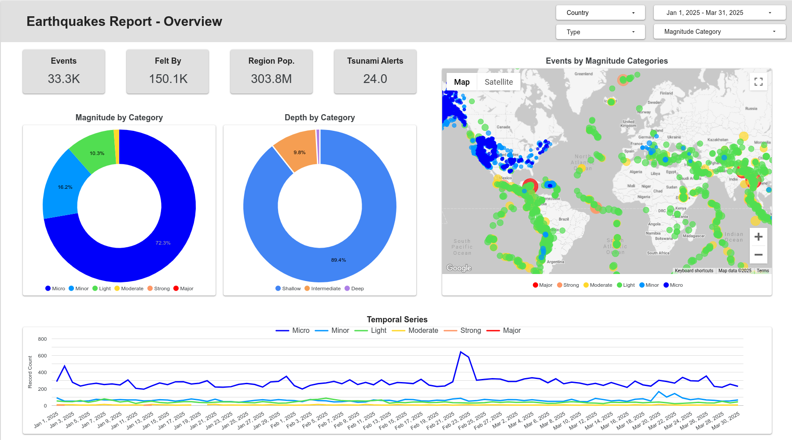
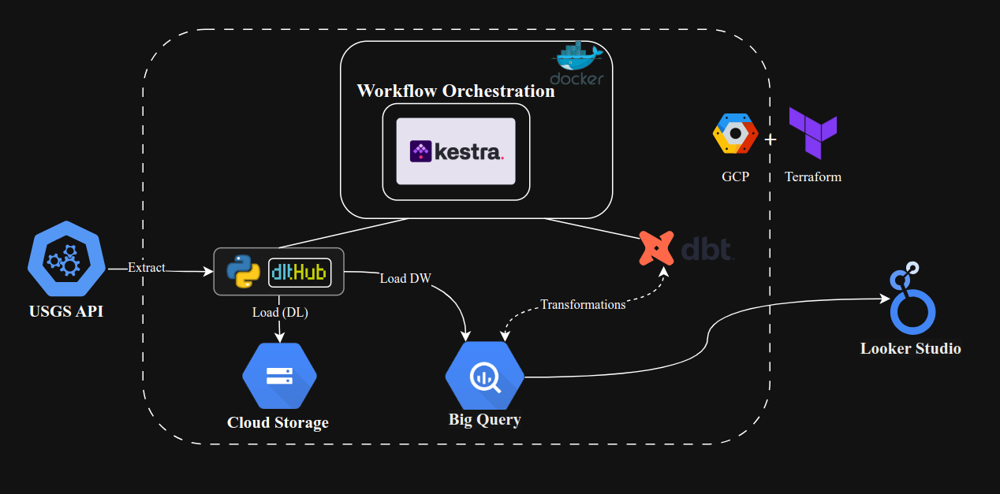

# Api Data Pipeline Project

This is a data pipeline project that extracts, loads and transforms(ELT) earthquake data from the USGS API into Google Cloud Platform (GCP) services and provides a dashboard for visualization of the enriched data.

## Dashboard Information

### Description

This dashboard provides a comprehensive overview of earthquake activity worldwide. It displays key metrics, as Big Numbers such as the number of events, people affected, population of impacted regions, and triggered tsunami alerts.

Key visualizations include:

- **Magnitude by Category**: A donut chart categorizing earthquakes from Micro to Major events.

- **Depth by Category**: A breakdown of earthquakes by depth: Shallow, Intermediate, and Deep.

- **Geographic Distribution**: An interactive map showing the locations of events color-coded by magnitude.

- **Temporal Series**: A time series graph illustrating daily earthquake counts by magnitude category over the selected time range.

The dashboard also features filters to view data by country, type, magnitude category, and date range, allowing for customized exploration of seismic activity patterns and trends and it can be accessed here:

- [Earthquakes Report Dashboard](https://lookerstudio.google.com/reporting/d20e44a3-1200-4785-8da5-cc219ba558ed).

## Problem Statement

Earthquake monitoring agencies like the USGS publish real-time and historical seismic event data through open APIs. However, the raw data arrives as JSON feeds with varying schemas, making
it challenging to:

- Incrementally ingest large volumes of seismic records without duplication
- Store and query time‑series earthquake data at scale
- Apply consistent transformations and enrichments (e.g. reverse geocoding coordinates)
- Automate end‑to‑end workflows across development, staging, and production environments

These challenges hinder both operational monitoring and analytical reporting, delaying insights into seismic activity patterns.

## Solution Overview

This repository delivers a cloud-native, automated data pipeline solution that addresses the above challenges.

### Architecture

1. **Infrastructure-as-Code**: Uses Terraform to provision GCP resources (GCS bucket, BigQuery dataset, Compute Engine VM for orchestration, etc).
2. **Service Account Authentication**: Leverages a secure GCP service account for API access and resource management.
3. **Workflow Orchestration**: Deploys Kestra on a managed VM to schedule and trigger pipeline jobs.
4. **Data Extraction & Loading**: Implements Python scripts with the DLT library to:
   - Fetch USGS API earthquake data
   - Load raw data as parquet files into GCS
   - Incrementally load data into BigQuery
   - Perform reverse geocoding to add human‑readable location data.
5. **Transformations**: Uses dbt to model, test, and document cleaned and aggregated tables (e.g., daily summaries, geographical analyses).
6. **Automation & CLI**: Provides Makefile targets for ease of:
   - Authentication
   - API activation
   - Terraform provisioning
   - Pipeline triggers (backfill and dbt runs)
   - UI launch
   - Teardown of provisioned resources.

By combining IaC, orchestration, incremental loading, and modern data modeling, this project ensures reliable, reproducible, and scalable processing of earthquake catalog data for monitoring and analytics.

## Local Development Setup - Replication

This section provides a guide to replicate the project in a fresh environment. It covers the prerequisites, setup instructions, and commands to run the pipeline.

### Cloud Initial Setup for IaC

1. **Google Cloud Account**: Ensure you have a Google Cloud account with billing enabled.
2. **GCP Project**: Create a new GCP project or use an existing one.

> [!TIP]
> For a detailed guide on Terraform - GCP initial setup check [Terraform GCP Guide](docs/terraform.md).
>
> For Step-by-step guide on how to run the project check [Step-by-Step Instructions](docs/instructions.md).

#### Steps to Replicate the Project

1. Clone the repository

2. Setup `.env` file

3. Use make to run the pipeline

> [!TIP]
> Additional info on make commands can be found in the [Makefile Guide](docs/makefile.md).

   1. `make gcloud-sa-auth` - Authenticate with Google Cloud using service account credentials
   2. `make activate-apis` - Enable required Google Cloud APIs for the project
   3. `make up` - Initialize Terraform and provision cloud infrastructure setup
        - This may take a few minutes to complete.
   4. `make app-ui` - Open Kestra UI in default browser
   5. `make backfill` - Trigger backfill flow (backfill start=YYYY-MM-DD end=YYYY-MM-DD)
      - Default: from 2024-01-01 to previous month
      - This may take a few minutes to complete as well.
      - Monitor the backfill process in the Kestra UI.
   6. `make dbt-run` - Run dbt transformations
      - Monitor the dbt run process in the Kestra UI.
   7. `make down` - (Optional) Destroy Terraform-managed cloud infrastructure
