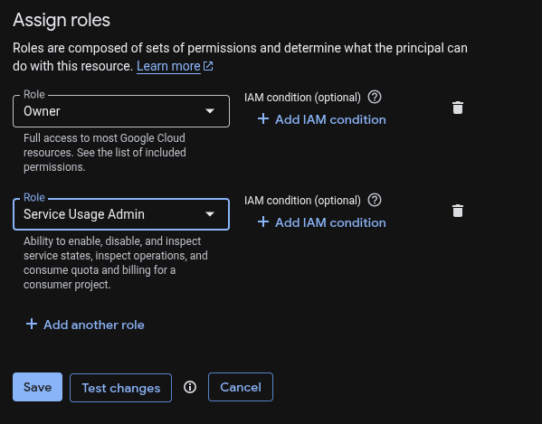
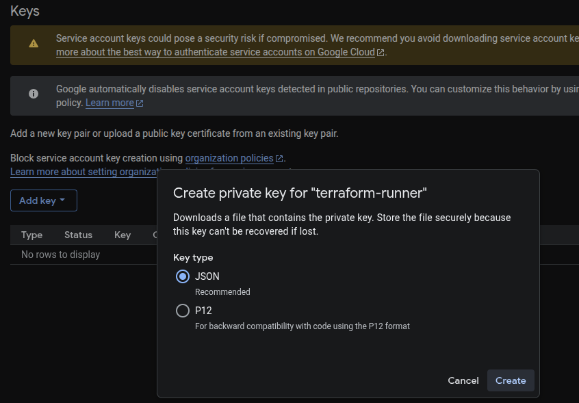

# Terraform - GCP Setup Guide

This guide walks you through creating and configuring a Google Cloud Platform (GCP) service account for Terraform.

## Prerequisites

1. Google Cloud account with billing enabled
2. GCP Project (create a new one or use an existing one)
3. [Google Cloud CLI](https://cloud.google.com/sdk/docs/install-sdk) installed and initialized

## Steps

### 1. Create Service Account

Create a service account in your GCP project console with the roles:

- Owner
- Service Usage Admin



> [!WARNING]
> The **Owner role** is used here solely to simplify project replication. Do not use it in production environments. Instead, follow the principle of least privilege and assign only the roles necessary for each task.

### 2. Generate Service Account Key

- Go to the IAM & Admin section in the GCP console
- Access the service account you have created
- Under `Keys`, select `Add key` > `Create new key` > `json`.

    

- Save the downloaded JSON key file in a secure location.
  - Usually under `~/.gcp/`
  - **Do not** share this file publicly or commit it to version control.

### 3. Configure Environment Variables

Edit `.env` to include your .json key file path to `GOOGLE_APPLICATION_CREDENTIALS`:

```bash
GCP_PROJECT_ID=your-gcp-project-id
GOOGLE_APPLICATION_CREDENTIALS=/full/path/to/service-account.json
ENV=dev
```

### 4. Ready to run Terraform

- You can now run Terraform commands using the service account you created.
- Get back to [Project Setup & Replication Guide](../README.md) to continue with the project setup.
